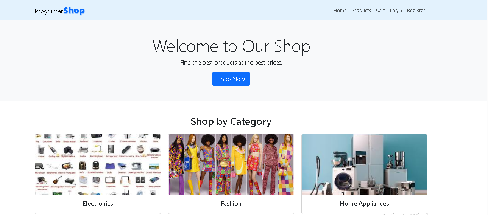

# 🛒 ProgramerShop - Simple E-Commerce Website

**ProgramerShop** is a simple frontend-only e-commerce web application built using **HTML**, **CSS**, **Bootstrap**, and **JavaScript**. It is designed for showcasing products, browsing categories, and demonstrating UI functionality like search and sorting without any backend or database.

---

🔗 **Live Demo:** [Click Here to Try the App](https://zihaddevvault.github.io/E-Commerce-Website/)  

## 📸 Screenshot

 

## 📌 Features

- ✅ Responsive layout using Bootstrap 5
- ✅ Homepage with Hero Section, Categories, and Featured Products
- ✅ Product listing with search and sort (by price)
- ✅ Individual Product Details page (structure only)
- ✅ Static Cart, Login, Register pages
- ✅ Clean and simple component-based file structure


---

## 📁 Project Structure
```
ProgramerShop/
│
├── index.html # Homepage
├── Pages/
│ ├── product.html # All products page (with search & sort)
│ ├── cart.html # Cart page
│ ├── login.html # Login form
│ ├── register.html # Register form
│ └── product-details.html # Product detail page
│
├── js/
│ ├── produtArry.js # Product data array
│ ├── productcard.js # Render card UI for product
│ └── products.js # Logic for search & sort
│
├── img/ # Static image assets (optional)
└── README.md # This file

```

---

## ⚙️ Technologies Used

- HTML5
- CSS3
- Bootstrap 5 (CDN)
- JavaScript ES6 (Modules)
- [Lorem Image Generator](https://picsum.photos/)

---

## 💻 Getting Started

You can clone or download the repository and run it locally in your browser.

```bash
git clone https://github.com/your-username/programershop.git
